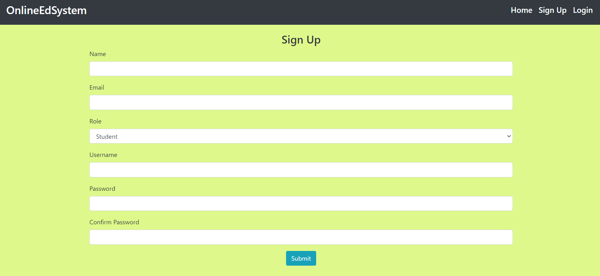
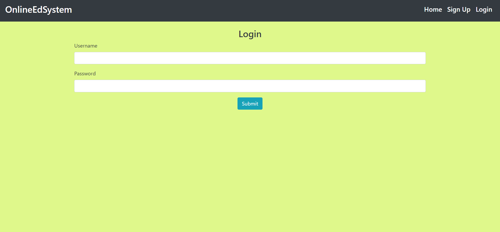
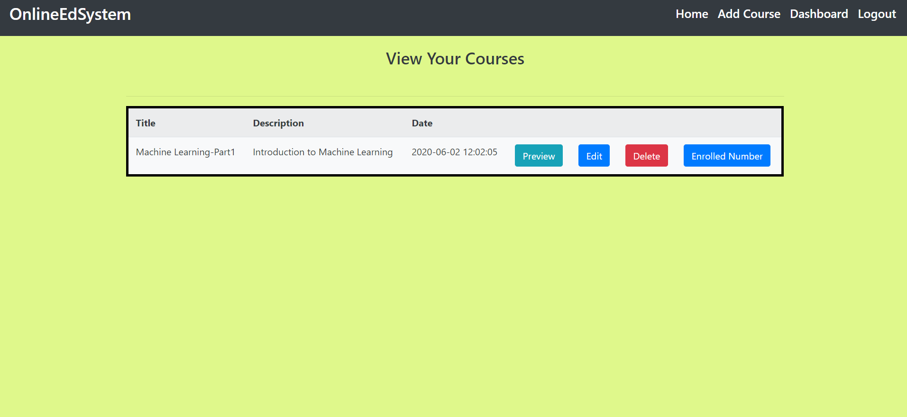
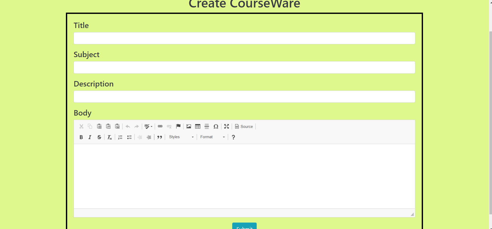
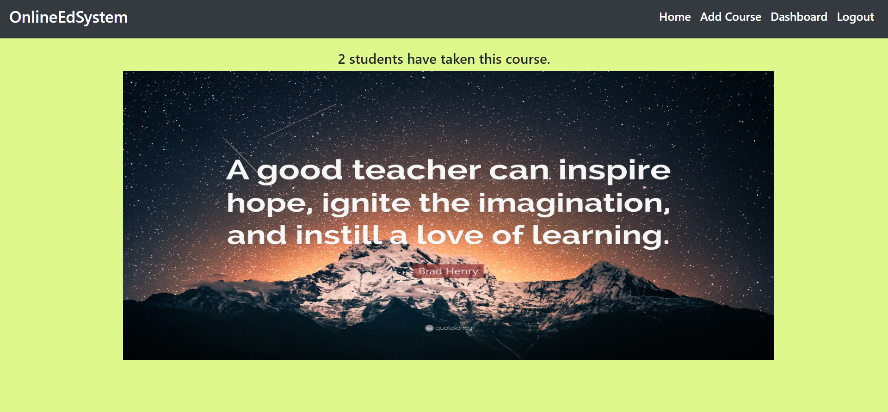
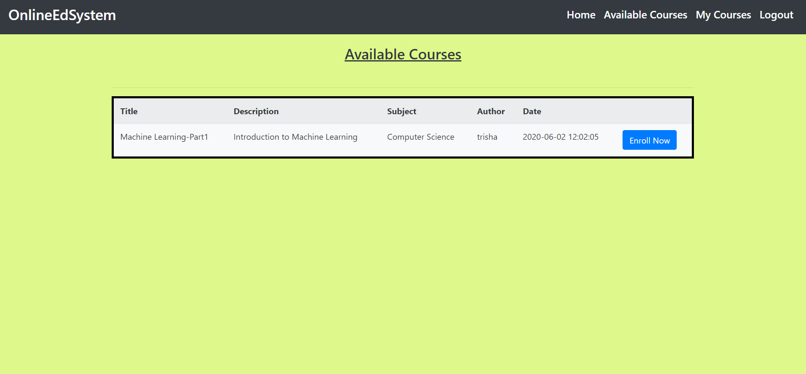
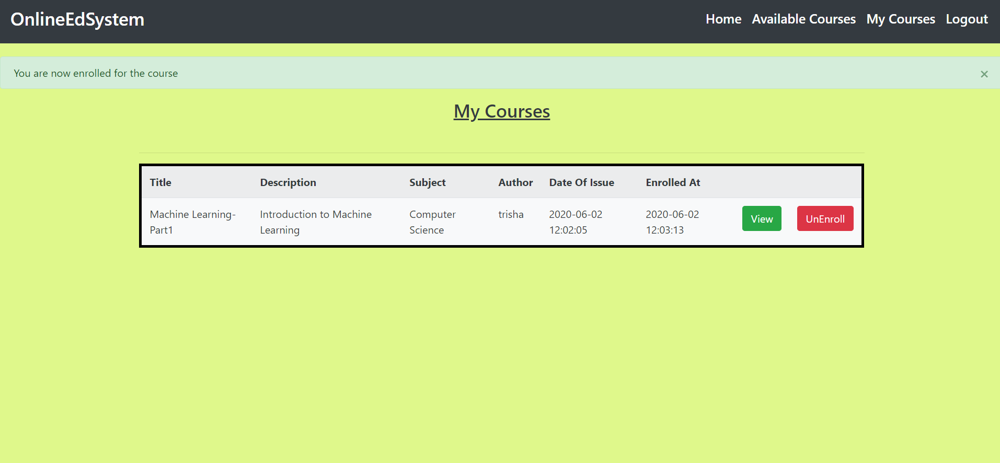

# A OnlineEdSystem Website

> The website allows you register and create course related study material if you are logged in as a teacher or gives access to the courses if you are logged in as a student.

> *Open to any recommendations to make this website better and more functional*

## Requirements
```
A version of python
pip package manager installed
Local instance of MySQL running on localhost as user root
Set MySQL password as an environment variable as 'MYSQL_PWD'
Run queries.sql
```
```bash
pip install flask
pip install mysqlclient
pip install flask-mysqldb
pip install flask-WTF
pip install passlib
```

## Quick Start

```bash
# Clone the repository
git clone https://github.com/yashjhaveri05/OnlineEdSystem.git
```

> ### Create a file called config.py that looks like
```python
import os

DEBUG = True
TESTING = True
MYSQL_HOST = 'localhost'
MYSQL_USER = 'root'
MYSQL_PASSWORD = os.getenv('MYSQL_PWD')
MYSQL_DB = 'course'
MYSQL_CURSORCLASS = 'DictCursor'
SECRET_KEY = 'your_secret_key'
```

## Go to the directory where you cloned the repository

> Run 
```bash
python app.py
```

Runs the app in the development mode.<br />

# Info

> In this website,a user can either signup as a student/teacher and hence access the respective pages when logged in.A Teacher can create,edit,delete and preview the courses they make and hence give access to the students to view and study them.On the other hand,a student can view a list of all the courses that the teacher has created and access any and study from it.They cannot make any changes to the course material.

> Mobile Responsive

# Overview Of The Website

<p align="center">Home Page</p>
<p align="center">
 
</p>

<p align="center">Sign Up Page-Two Types of Users: Either Student/Teacher</p>
<p align="center">
 
</p>

<p align="center">Login Page</p>
<p align="center">
 
</p>

<p align="center">Teacher Login Dashboard</p>
<p align="center">
 
</p>

<p align="center">Teacher Add Course</p>
<p align="center">
 
</p>

<p align="center">Teacher View to see number of enrolled students for a particular course</p>
<p align="center">
 
</p>

<p align="center">Student Available Courses</p>
<p align="center">
 
</p>

<p align="center">Student Enrolled Courses</p>
<p align="center">
 
</p>

<p align="center">Course Detail Page</p>
<p align="center">
 
</p>

## App Info

### Author [Yash Jhaveri](https://www.linkedin.com/in/yash-jhaveri-3b0882192/)

